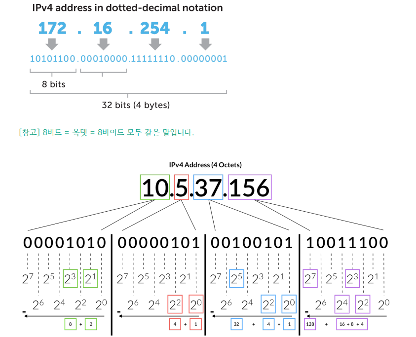
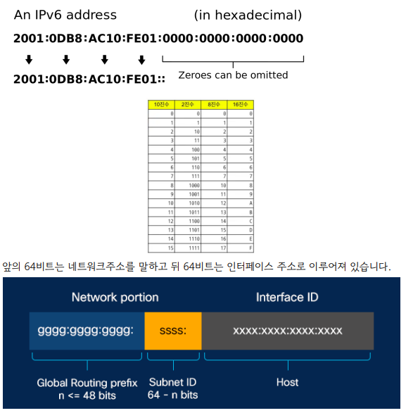
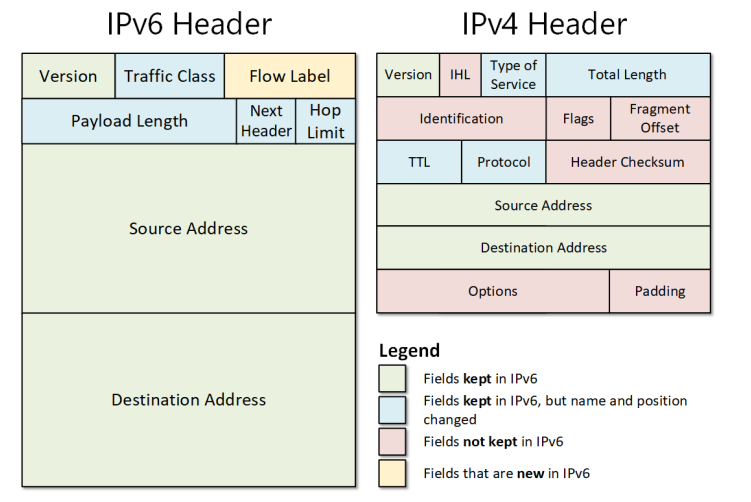
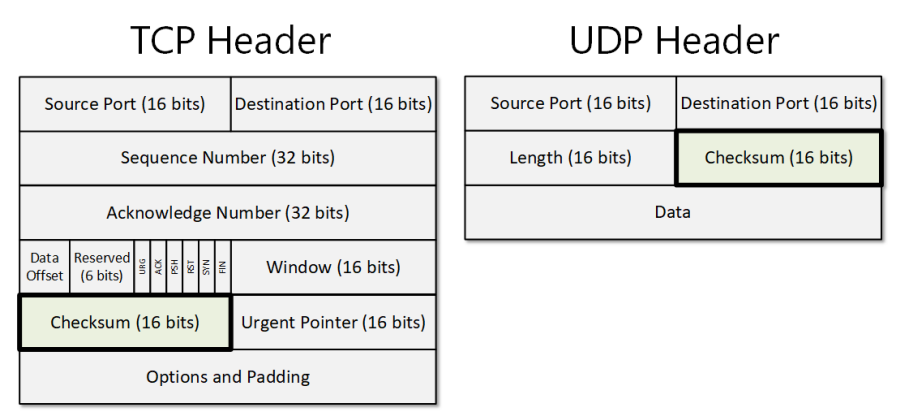

## IPv4, IPv6
### IPv4
- 32비트로 표현되는 주소체계이며 2^32개의 주소(41억 9천만 주소)를 표현할 수 있음
- 8비트 단위로 점을 찍어 4개로 구분해서 표현하며 보통 8비트를 10진수로 표현해서 말함
- 이 주소체계만으로는 부족하기 때문에  NAT, 서브네팅 등 여러개의 부수적인 기술이 생겨남

### IPv6
- 128비트로 표현되는 주소체계이며 2^128개의 주소를 표현
- 많은 주소 처리가 가능하며 NAT, 서브네팅이 필요하지 않음
- 16비트씩 8개로 구분하고 16비트는 16진수로 변환되어 콜론(:)으로 구분하여 표시하며 앞의 연속되는 0은 생략될 수 있음

- IPSec이 내장됨
  - 데이터 패킷을 암호화하는 보안 네트워크 프로토콜 제품군
- 단순해진 헤더 포맷
  - IPv6는 IPv4 헤더의 불필요한 필드를 제거하여 보다 빠른 처리 가능

### IPv4는 체크섬이 있지만 IPv6는 없다
- IPv4에는 CRC를 통한 손상된 패킷을 확인하고 폐기하는데 쓰는 체크섬 필드가 있음(Header Checksum 필드)
- IPv6는 해당 체크섬 필드가 존재하지 않음
- 상위 프로토콜(TCP, UDP)에 체크섬 필드가 있기 때문에 헤더의 효율화를 위해 버전이 업그레이드되면서 사라짐

- TCP Header, UDP Header 모두 체크섬 필드가 들어가 있음
- 만약 체크섬 필드를 사용하지 않는 것으로 설정하고 싶다면 해당 필드의 값을 모두 0으로 만들면 됨
- 이를 통해 체크섬 필드를 유동적으로 사용하거나 사용하지 않게 만들 수 있음
- 다만 IPv6 + UDP로 사용할 경우 IPv6의 헤더내의 체크섬 필드가 없기 때문에 무조건 UDP 헤더의 체크섬 필드를 사용한다고 설정해야 함
- IPv4는 헤더가 가변길이, IPv6는 고정길이(40바이트) (인터넷 헤더길이에 대한 정보가 없음)

### CRC
- 순환중복검사로 네트워크상에서 데이터에 오류가 있는지 확인하기 위한 체크값을 결정하는 방식
- 데이터를 전송하기 전에 주어진 데이터의 값에 따라 CRC값을 계산하여 데이터에 붙여 전송하고, 데이터 전송이 끝난 후
받은 데이터의 값으로 다시 CRC값을 계산하게 됨
- 이어서 두 값을 비교하고, 이 두 값이 다르면 데이터 전송 과정에서 잡음 등에 의해 오류가 덧붙여 전송된 것임을 알 수 있음

### IPv6에서 TTL은 HOP limit로 대체됨
- TTL
  - IPv4에서 TTL 필드는 패킷이 네트워크에서 무한순환하지 않도록 하는 변수
  - 패킷이 네트워크에서 라우터를 거칠 때마다 TTL값이 1씩 감소. 값이 0이 되면 패킷이 폐기됨
- 해당 변수가 HOP limit 라는 이름으로 대체됨

### IPv4 vs IPv6
- IPv6는 IPv4보다 많은 주소 표현 가능
- IPv6는 IPv4보다 불필요한 헤더가 삭제되어서 빠르고 기본적으로 IPSec이라는 네트워크 보안제품군이 포함되어있어 보안적인 측면에서도 좋음
- 보통은 IPv6를 사용하는것이 속도가 더 빠르지만 일부 사용사례에서는 속도가 느린 경우도 있음