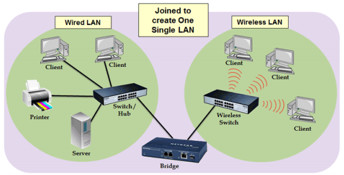

## LAN, MAN, WAN
- 네트워크는 LAN, MAN, WAN으로 분류
- LAN 가장 작은 단위, WAN 가장 큰 단위 이며 보통은 반경, 속도의 크기를 기반으로 분류
- 반경이나 속도는 기술의 발전에 따라 바뀌는 개념적으로 이해하고 분류하는게 중요

### LAN (Local Area Network, 근거리 통신망)
- MAN, WAN보다 높은 안정성, 속도
- 소규모 네트워크(집, 사무실)
- 보통 허브나 스위치로 연결된 네트워크

- 하나의 논리적 주소인 IP를 기반으로 여러개의 물리적 주소인 MAC 주소를 구별하는 네트워크라고도 볼 수 있음

### MAN (Metropolitan Area Network, 대도시 통신망)
- 도시와 도시의 통신망을 뜻하며 2개 이상의 LAN이 연결되어 구성됨
- 라우터, 브리지 등으로 연결되는 것이 특징

### WAN (Wide Area Network, 광역 통신망)
- 국가와 국가의 통신망
- 인터넷이라고도 함
- 수많은 라우터를 거쳐 다른 국가와도 연결되는 범위를 말함
