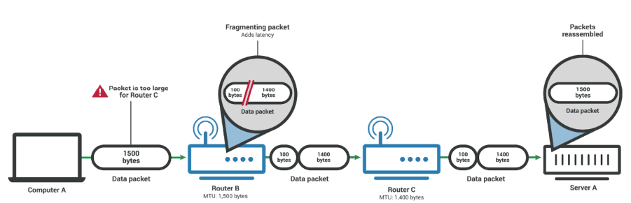

## MTU, MSS, PMTUD
- MTU(Maximum Transmission Unit)란 네트워크에 연결된 장치가 받아들일 수 있는 최대 데이터 패킷의 크기를 말함
- 이 크기를 기준으로 데이터는 쪼개져서 패킷화 됨
- 네트워크 경로 상에 있는 아무 장치나 MTU보다 패킷이 크면 그 패킷은 분할될 수도 있음

### 패킷이 분할되지 않는 경우
- 패킷을 분할할 수 없어 네트워크 경로 상에 있는 어떠한 라우터나 장치의 MTU를 초과할 때 분할해서 전달하는
것이 아니라 전달을 아예 하지 않을 수도 있음
- IPv6는 분할을 허용하지 않음
- IPv4

- IPv4 헤더에는 flags라는 필드가 있는데 여기서 bit 이 1이되면 "Don't Fragment" 플래그가
활성화된다라는 의미. 이 때 분할은 불가능

### MTU, MSS
- MTU는 IP헤더와 TCP헤더의 크기까지 합침
- MSS(Maximum Segment Size)는 데이터의 크기(payload의 크기)만을 가리킴

- 일반적으로 MTU는 1500바이트이며 MSS는 1460바이트
- 따라서 네트워크를 통해 데이터를 보낼 때 MTU가 1500이라도 데이터는 보통 1460바이트 이하의 크기로 보내야 전달이 됨
- 다만, TCP를 쓰지 않는다는 등의 이유로 달라질 수도 있음

### PMTUD
- PMTUD(Path MTU Discovery)는 수신자와 송신자의 경로 상에서 장치가 패킷을 누락한 경우 테스트 패킷의 크기를
낮추면서 MTU에 맞게끔 반복해서 보내는 과정을 말함