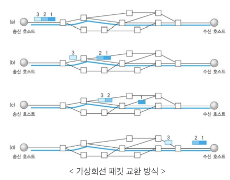
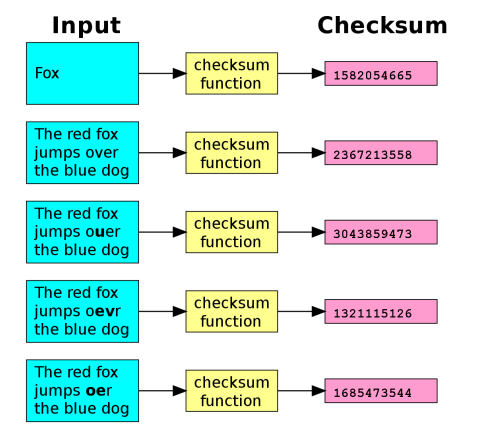
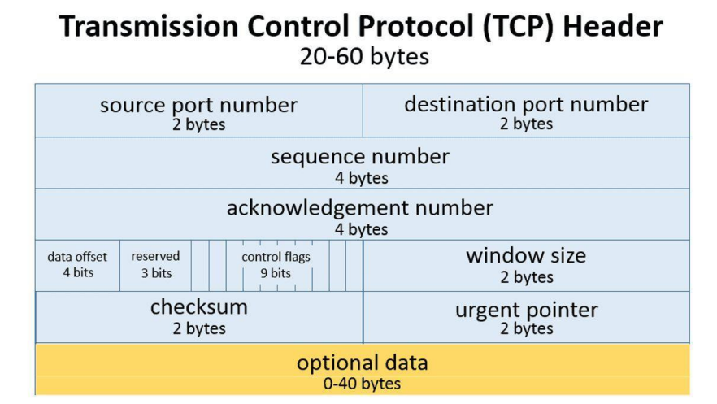
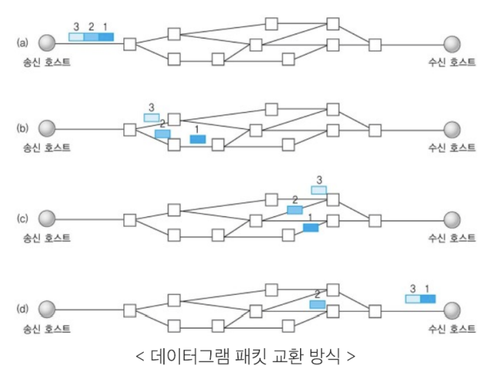
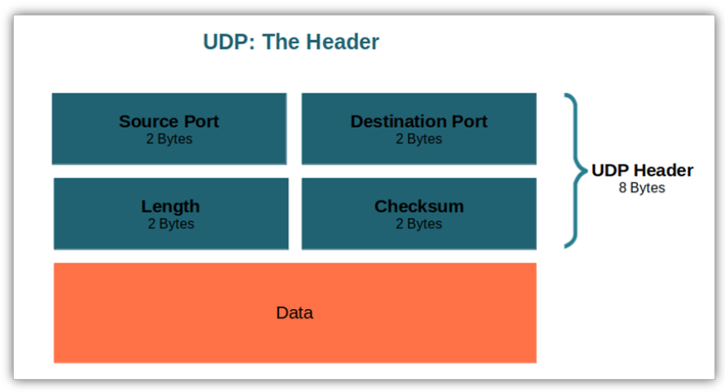
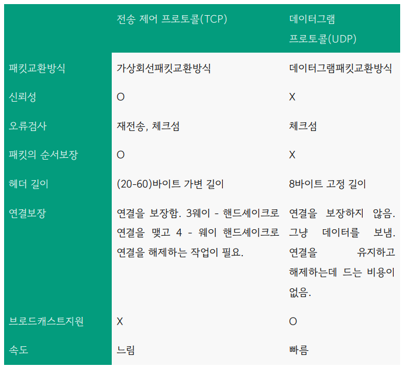

## 전송 계층(transport)
- TCP, UDP가 대표적이며 애플리케이션 계층에서 받은 메시지를 기반으로 세그먼트 또는 데이터그램으로
데이터를 쪼개고 데이터가 오류없이 순서대로 전달되도록 도움을 주는 층

### TCP
- 가상회선 패킷교환 방식

- 오류검사 메커니즘
  1. 재전송 : 시간 초과 기간이 지나면 서버는 전달되지 않은 데이터에 대해 재전송을 시도
  2. 체크섬 : 체크섬을 통해 무결성을 평가. 즉, 송신된 데이터의 체크섬과 수신된 데이터의 체크섬 값을 비교해서 올바르게 왔는지를 확인

- 헤더

20 ~ 60 바이트로 가변적

### UDP
- 데이터그램 패킷교환 방식

- 오류검사는 단순한 체크섬만 지원
- 헤더(8바이트 고정길이)

### TCP vs UDP
