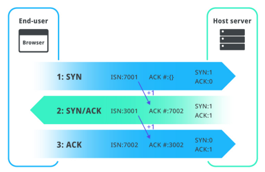
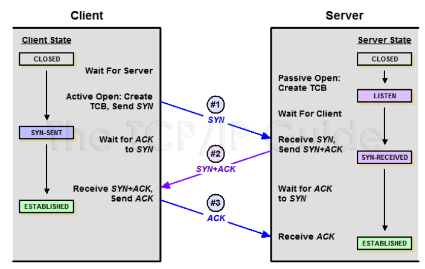

## 3-웨이 핸드셰이크
TCP 연결성립의 3개 과정
- SYN 단계 : 클라이언트는 서버에 클라이언트의 ISN을 담아 SYN을 보냄
- SYN + ACK 단계 : 서버는 클라이언트의 SYN을 수신하고 서버의 ISN을 보내며 승인번호로 클라이언트의 ISN + 1을 보냄
- ACK 단계 : 클라이언트는 서버의 ISN + 1한 값이 승인번호를 담아 ACK를 서버에 보냄

### ISN
- TCP(Transmission Control Protocol) 기반 데이터 통신에서 각각의 새 연결에 할당된 고유한 32비트 시퀀스 번호를 나타냄
- TCP 연결을 통해 전송되는 다른 데이터 바이트와 충돌하지 않는 시퀀스 번호를 할당하는 데 도움이 됨
- SYN : synchronization의 약자, 연결 요청 플래그
- ACK : acknowledgement의 약자, 응답 플래그

### 클라이언트와 서버의 상태
- TCP연결을 하면서 클라이언트는 closed, syn-sent, established가 되며 server는 closed, listen, syn_received, established 상태가 됨

- 이러한 서버와 클라이언트 간의 연결 설정 과정이 있기 때문에 TCP는 신뢰성이 있다라고 함
- 반대로 UDP는 이러한 과정이 없어 신뢰성이 없다라고 함

### listen
- 서버는 클라이언트의 연락을 기다리는 상태, 이를 기반으로 서버 메서드의 이름이 결정됨