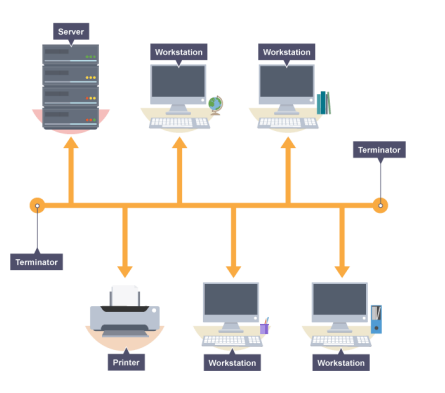
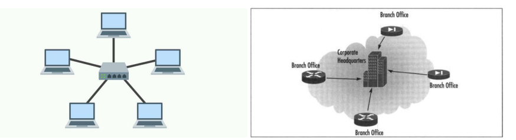
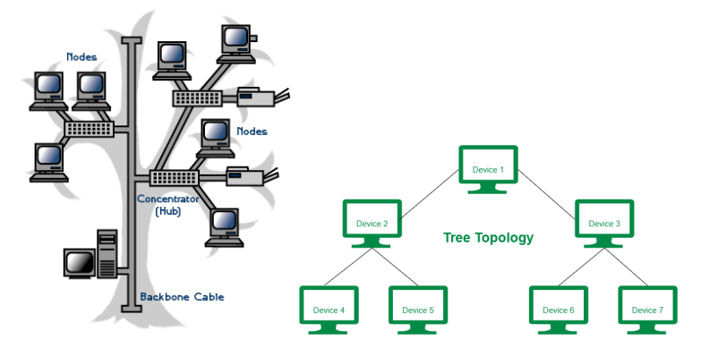
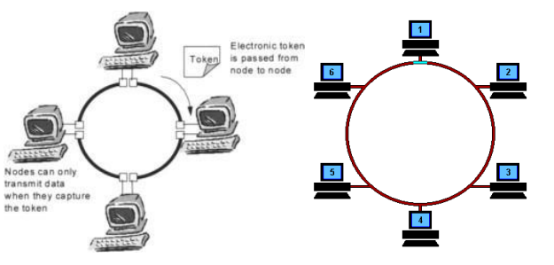
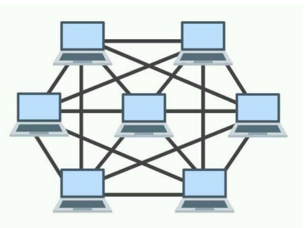
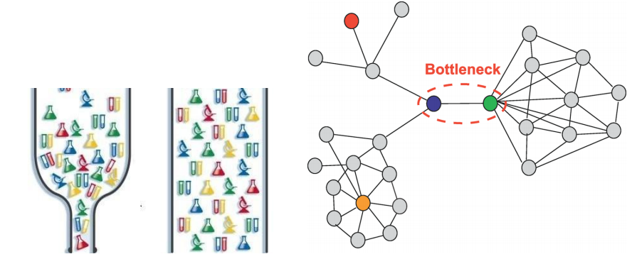

## 네트워크 토폴로지
노드와 링크가 어떻게 구성되어 있는지를 의미

### 버스 토폴로지

- 특징
  - 하나의 회선에 여러개의 노드
  - 노드 추가, 삭제 쉬움
  - 설치 비용 적음
- 장점
  - 소규모 네트워크를 구축하기 매우 쉬움
  - 한 노드에 장애가 발생해도 다른 노드에 영향 X
- 단점
  - 메인 링크에 많은 트래픽이 생기면 정체현상 발생 가능성 높음.(패킷 손실율 높음)
  - 메인 링크 망가지면 큰 문제

### 스타 토폴로지

- 특징
  - 중앙에 있는 노드를 기반으로 연결된 형태
  - 노드 추가, 삭제 쉬움
- 장점
  - 중앙노드가 아닌 한 노드에 장애가 발생해도 다른 노드에 영향X
  - 안정성이 높음
    - 중앙노드가 아닌 한 노드에 침해가 발생했을 때 다른 노드로 확장하기가 어렵기 때문
    - 다른 노드로 가려면 중앙노드를 무조건 거쳐야 하고 보통의 스타토폴로지는 중앙노드의 방화벽 등을 더욱 깐깐하게 해놓음
  - 한 링크에 문제가 생겨도 해당 부분만 영향을 받고 나머지 부분은 정상적으로 작동함
- 단점
  - 중앙노드 에러시 큰 문제

### 트리 토폴로지

- 특징
  - 트리 형태(계층적 토폴로지라고도 함)
  - 노드 추가, 삭제 보통(리프노드를 기반으로 확장은 용이하지만 다른 노드는 어려움)
  - 버스 토폴로지와 스타 토폴로지의 하이브리드 형태
- 장점
  - 노드 확장이 용이(주로 리프노드로 확장)
  - 리프노드의 에러는 나머지 부분에 영향을 미치지 않음
- 단점
  - 특정 노드 트래픽 집중 시 하위노드에 영향
  - 루트노드에 문제가 생기면 전체네트워크에 큰 문제

ex) 백본케이블 : 여러 소형 네트워크들을 묶어 대규모 파이프라인을 통해 극도로 높은 대역폭으로 다른 네트워크들의
집합과 연결되는 네트워크(대규모 패킷 통신망)

### 링형 토폴로지

- 특징
  - 고리 형태
  - 노드 추가, 삭제가 쉬움
- 장점
  - 노드 수가 많아져도 데이터 손실이 없음
  - 토큰을 기반으로 연속적으로 노드를 거치며 통신권한 여부를 따지고 해당 권한이 없는 노드는 데이터를 전달받지 않음
- 단점
  - 링크 또는 노드가 하나만 에러가 발생해도 전체 네트워크에 영향
  - 토큰이 없는 노드는 통신에 참여를 못하며 데이터 공유가 안됨

### 메시 토폴로지

- 특징
  - 그물망 형태
  - 노드 추가, 삭제 어려움
  - 풀(full)메시 토폴로지의 경우 n * (n - 1) / 2 의 회선이 필요함
- 장점
  - 안정성이 높음. 한 노드에 장애가 나도 다른 노드에 영향을 미치지 않음
  - 트래픽을 분산할 수 있음
- 단점
  - 회선이 비효율적으로 많기 때문에 구축비용이 고가임

### 필요성
- 토폴로지를 파악함으로써 병목현상을 해결하는 척도가 됨

### 병목 현상
- 네트워크에서는 트래픽에 의해 데이터 흐름이 제한되는 상황을 의미
- 일명 핫스팟이라 함

- 해결 사례
  - 구축된 시스템의 토폴로지를 알고 있다면 어떠한 부분에 어떠한 회선 또는 어떠한 서버의
용량을 증가시켜야 하는지 알 수 있음