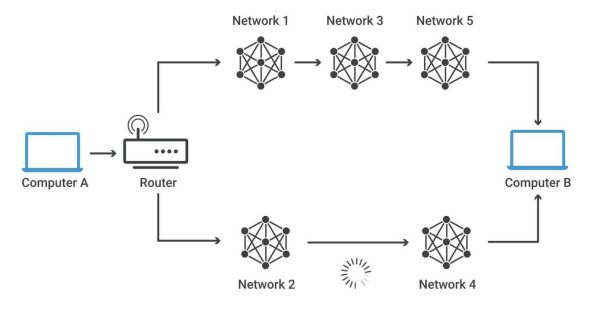
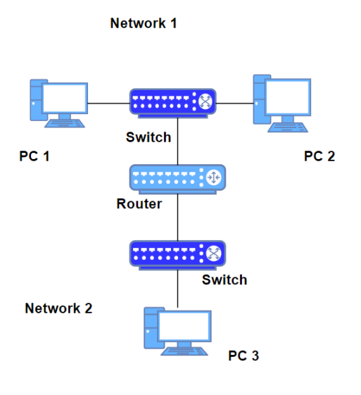
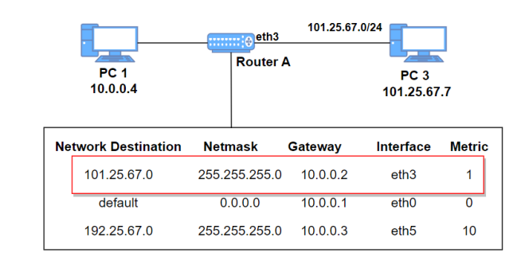

## 개념, 라우터, 라우팅 테이블
- 라우팅(routing)은 네트워크에서 데이터(패킷)를 보낼 때 최적의 경로를 선택하는 과정이며 라우터가 이를 수행   
- 데이터는 보통 출발지에서 목지로 가는 동안 여러개의 라우터를 거치며 여러번의 라우팅을 수행(라우팅은 보통 초당 수백만번 일어남)

### 라우터
- 네트워크 사이에서 데이터를 전달하는 장치이며 보통 둘 이상의 서로 다른 네트워크에 연결됨
- 데이터(패킷)를 목적지로 보낼 때 최적의 경로를 결정하고 경로가 결정되면 해당 겨로로 데이터를 넘겨주는 일을 수행   
- 라우터는 라우팅테이블을 기반으로 데이터를 다음 목적지에게 전달

### 라우팅 테이블
- IP 주소를 기반으로 라우터의 위치를 저장한 테이블 또는 데이터베이스이며 다양한 네트워크에 대한 정보와
해당 네트워크에 연결하는 방법이 포함됨

### 라우팅 테이블의 구성요소

- 네트워크 대상(Network Destination) : 목적지 네트워크의 IP주소
- 서브넷 마스크(Netmask) : 대상 주소를 설명할 때 쓰이는 값
- 게이트웨이(Gateway) : 이 장치와 연결되어 있는 홉, 패킷이 전달되는 다음 IP주소(외부 네트워크와 연결된 장치)
만약 목적지가 로컬 네트워크라면 "연결됨(connected)"라고 표기 되며 다른 네트워크라면 해당 네트워크의 게이트웨이를 가리킴
- 인터페이스(interface) : 게이트웨이로 가기위해 거치는 장치 / 10.0.0.2는 eth3을 통해 접근이 가능
- 메트릭(Metric) : 우선순위라고도 불리며 패킷 전송을 위해 최적의 경로가 선택되도록 참고되는 값.
동일한 라우팅테이블 요소가 2개 있을 때 이 값이 낮은 요소가 선택됨. 메트릭은 일반적으로 홉 수(hop count)가
들어가며 지연시간, 처리량 등이 들어갈 수 있음