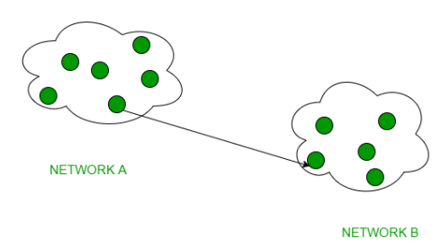

## 유니캐스트, 멀티캐스트, 브로드캐스트
### 유니캐스트
- 1 : 1 통신
- 대표적으로 HTTP통신
- 가장 일반적인 네트워크 전송 형태

### 멀티캐스트
- 1 : N 통신
- 연결된 모든 노드들에 데이터를 전달하지 않고 특정 그룹에만 데이터를 전달

### 브로드캐스트
- 1 : N 통신
- 그룹이 아닌 연결된 모든 노드에게 데이터를 전달
- ex) ARP
