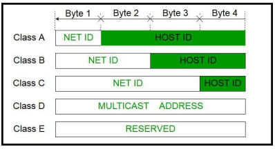
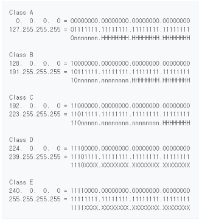

## 클래스풀 (Classful IP Addressing)
- IP주소는 인터넷 주소로 네트워크 주소, 호스트 주소 두 부분으로 나뉨
- 네트워크 주소는 호스트들을 모은 네트워크를 지칭
  - 네트워크 주소가 동일 = 로컬네트워크
  - 호스트 주소 : 호스트를 구분하기 위한 주소
  - 네트워크 호스트(network host)는 컴퓨터 네트워크에 연결된 컴퓨터나 기타 장치

### 정의
- 네트워크 주소를 매기고 그에 따라 네트워크의 크기를 다르게 구분하여 클래스를 할당하는 주소체계
- 구분하는 기준자(1, 2, 3옥텟)를 서브넷마스크라고 함

### 클래스 A
|  | 7 Bit | 24 Bit |
| --- | --- | --- |
| 0 | Network | Host |

- 2 ^ 24 - 2 = 한 네트워크당, 16,777,214 호스트 ID(약 1600만개) / 0
- 네트워크 주소 범위 : 1 ~ 126로 시작 / 원래는 127.255.255.255 까지 포함하지만 127.X는 루프백 주소이기
때문에 포함 x / 0.0.0.0 도 특수주소로 포함 x(알 수 없는 대상에 달아 놓는 임시 주소)

### 클래스 B
|  | 14 Bit   | 16 Bit |
| --- |---------|--------|
| 0 | Network | Host   |

- 2 ^ 16 - 2 = 한 네트워크당 65532 호스트 ID(6만 5천개) / 10
- 네트워크 주소 범위 : 128 ~ 191로 시작

### 클래스 C
|  | 21 Bit  | 8 Bit |
| --- |---------|-------|
| 0 | Network | Host  |

- 2 ^ 8 - 2 = 한 네트워크당 254 호스트 ID / 110
- 네트워크 주소 범위 : 192 ~ 223로 시작

---
- 주소 - 2 : 맨 앞자리는 네트워크 주소로 남겨두며 마지막 주소는 브로드캐스팅 주소로 남겨놓음
### 문제점
- 네트워크의 크기가 작은 경우 큰 네트워크를 필요로 하는 조직은 여러개를 확보해야 하는 어려움이 생김
- 작은 네트워크가 필요한 조직의 경우 너무 많은 IP를 가져가므로 IP가 낭비되는 문제점이 있음
